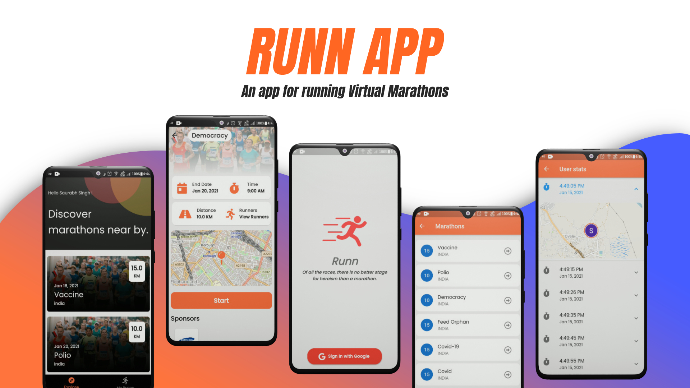
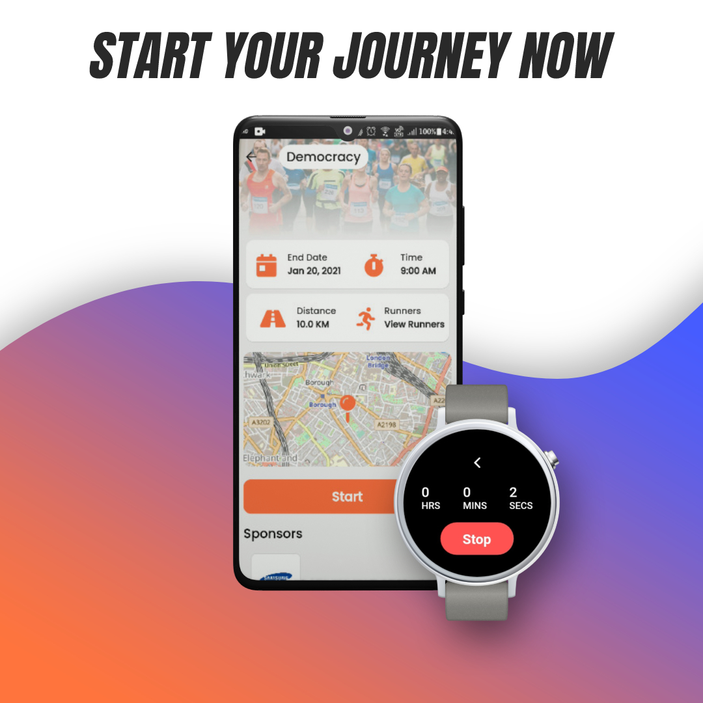

# Runn Flutter App
An app for participating in Marathons virtually

- This app has its backend setup with Django and Datastax Astra&trade;
- [Backend Repository Link](https://github.com/Saurabh-Singh-00/runn-backend/tree/astra "Backend")

### Features
- [Companion Smatch watch app](https://github.com/Saurabh-Singh-00/runn-wear "Wear App")
- Google Sign In
- Participate in marathons Virtually or Onsite
- Just participate and run whenever you like
- Track your location
- Watch out for distance travelled
- See other runners in marathon
- Best of all this app keeps you healty

### Getting Started
- Before running the app please setup and start the [Backend server](https://github.com/Saurabh-Singh-00/runn-backend/tree/astra "Backend Astra")
- After your backend has successfully started please obtain the IP address of your local computer

- Linux / Mac `ifconfig`

- Windows `ipconfig`

- You will see the IPv4 address like `192.168.0.104`

- Replace `baseUrl` in `lib/providers/base_data_provider.dart` with your IP address

